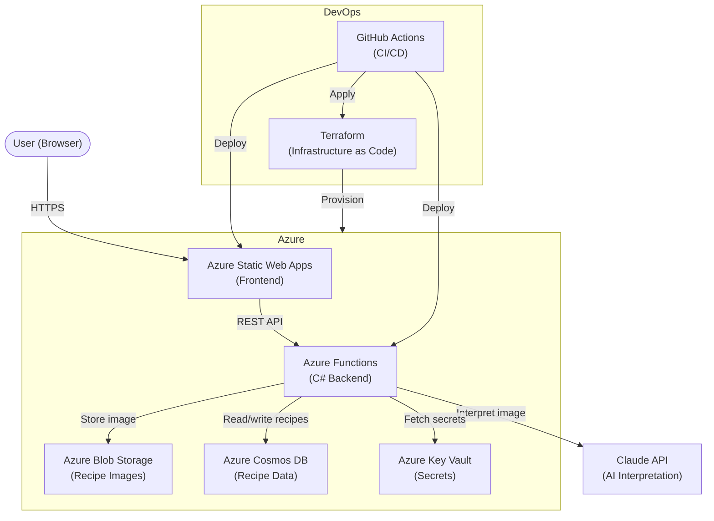

# Forgotten Family Recipes

A cloud-native digital family cookbook that preserves handwritten recipes using AI interpretation. Upload a photo of a handwritten recipe card and the application extracts, structures, and stores it — making family food traditions searchable and shareable for generations.

Built as a portfolio project to demonstrate end-to-end skills in **cloud architecture**, **DevOps**, **infrastructure-as-code**, and **system development**.

---

## Table of Contents

- [Purpose](#purpose)
- [Architecture Overview](#architecture-overview)
- [Tech Stack](#tech-stack)
- [Folder Structure](#folder-structure)
- [Running Locally](#running-locally)
- [CI/CD Pipeline](#cicd-pipeline)
- [Security](#security)
- [Cost Management](#cost-management)

---

## Purpose

Many families have recipes that exist only on aging paper — handwritten by grandparents, scrawled on index cards, or tucked into old cookbooks. This project solves that by:

1. Accepting a photo of a handwritten or printed recipe
2. Using the **Claude AI API** to interpret and extract structured recipe data from the image
3. Storing the result in a cloud database for easy retrieval
4. Serving it through a fast, globally distributed static frontend

The technical goal is to demonstrate a production-grade cloud system: serverless backend, IaC-managed infrastructure, automated deployments, and secure secrets handling — all built on Azure.

---

## Architecture Overview



**Flow:**
1. User uploads a recipe image via the frontend
2. The Upload Function stores the image in Blob Storage
3. The Interpretation Function sends the image to the Claude API
4. Claude returns structured recipe data (title, ingredients, steps)
5. The data is saved to Cosmos DB
6. The frontend fetches and displays the recipe

---

## Tech Stack

| Layer | Technology | Purpose |
|---|---|---|
| Frontend | Azure Static Web Apps | Globally distributed hosting, built-in auth |
| Backend | C# Azure Functions | Serverless HTTP endpoints |
| Database | Azure Cosmos DB | NoSQL storage for recipes |
| Image Storage | Azure Blob Storage | Stores uploaded recipe photos |
| AI | Claude API (Anthropic) | Interprets handwritten recipe images |
| IaC | Terraform (modular) | Provisions and manages all Azure infrastructure |
| CI/CD | GitHub Actions | Automated build, test, and deploy pipeline |
| Secrets | Azure Key Vault | Secure storage for API keys and connection strings |

---

## Folder Structure

```
forgotten-family-recipes/
│
├── infra/                      # Terraform — infrastructure as code
│   ├── main.tf                 # Root module, wires together all modules
│   ├── variables.tf            # Input variable declarations
│   ├── terraform.tfvars        # ⚠️  Local values — never committed to Git
│   └── modules/
│       ├── storage/            # Blob Storage module
│       ├── functions/          # Azure Functions module
│       ├── static-web/         # Static Web App module
│       └── keyvault/           # Key Vault module
│
├── backend/                    # C# Azure Functions project
│   ├── Functions/              # HTTP-triggered endpoints (thin layer)
│   ├── Services/               # Business logic (recipe parsing, AI calls)
│   ├── Models/                 # Data structures and DTOs
│   └── Helpers/                # Shared utilities
│
├── frontend/                   # Static Web App (SPA)
│
├── .github/
│   └── workflows/              # GitHub Actions pipeline definitions
│
├── .gitignore
├── CLAUDE.md                   # AI assistant instructions for this repo
└── README.md
```

---

## Running Locally

### Prerequisites

| Tool | Version | Purpose |
|---|---|---|
| [.NET SDK](https://dotnet.microsoft.com/download) | 8.0+ | Build and run Azure Functions locally |
| [Azure Functions Core Tools](https://learn.microsoft.com/en-us/azure/azure-functions/functions-run-local) | v4 | Local Functions runtime |
| [Terraform](https://developer.hashicorp.com/terraform/install) | 1.5+ | Provision infrastructure |
| [Azure CLI](https://learn.microsoft.com/en-us/cli/azure/install-azure-cli) | Latest | Authenticate and manage Azure resources |
| [Azurite](https://learn.microsoft.com/en-us/azure/storage/common/storage-use-azurite) | Latest | Local emulator for Blob Storage |
| An Anthropic API key | — | Required for AI interpretation |

### Setup

**1. Clone the repository**
```bash
git clone https://github.com/your-username/forgotten-family-recipes.git
cd forgotten-family-recipes
```

**2. Configure local backend settings**

Create `backend/local.settings.json` (this file is gitignored):
```json
{
  "IsEncrypted": false,
  "Values": {
    "AzureWebJobsStorage": "UseDevelopmentStorage=true",
    "FUNCTIONS_WORKER_RUNTIME": "dotnet-isolated",
    "ClaudeApiKey": "your-anthropic-api-key",
    "CosmosDbConnectionString": "your-cosmos-connection-string"
  }
}
```

**3. Start the local storage emulator**
```bash
azurite --silent --location .azurite --debug .azurite/debug.log
```

**4. Run the Azure Functions backend**
```bash
cd backend
func start
```

**5. Serve the frontend**

Open `frontend/index.html` directly in a browser, or use a local server:
```bash
npx serve frontend
```

**6. (Optional) Provision infrastructure with Terraform**
```bash
cd infra
cp terraform.tfvars.example terraform.tfvars  # fill in your values
terraform init
terraform plan
terraform apply
```

---

## CI/CD Pipeline

Deployments are fully automated via **GitHub Actions**.

```
Push to main
     │
     ├──▶ [Terraform Plan]
     │       Validates infrastructure changes
     │       Posts plan summary as PR comment
     │
     ├──▶ [Build & Test Backend]
     │       dotnet build
     │       dotnet test
     │
     ├──▶ [Deploy Infrastructure]  (on merge to main)
     │       terraform apply
     │
     └──▶ [Deploy Application]     (on merge to main)
             Deploy Azure Functions
             Deploy Static Web App
```

**Branch strategy:**
- `main` — production deployments trigger automatically
- Feature branches — plan and build run on pull request; no deploy

Secrets such as Azure credentials and the Anthropic API key are stored as **GitHub Actions Secrets** and injected at runtime — never written to files or logs.

---

## Security

| Concern | Approach |
|---|---|
| API keys and connection strings | Stored in **Azure Key Vault**; Functions fetch them at runtime via managed identity |
| Local development secrets | `local.settings.json` and `terraform.tfvars` are gitignored |
| GitHub Actions credentials | Stored as encrypted **GitHub Secrets**; scoped to the minimum required permissions |
| Azure identity | Functions use a **Managed Identity** to access Key Vault — no static credentials |
| Image uploads | Validated server-side before storage; Blob Storage is not publicly listed |
| Infrastructure state | `*.tfstate` files are gitignored; remote state (Azure Storage backend) is recommended for team use |

---

## Cost Management

This project is designed to stay within the Azure free tier and low-cost services during development.

| Service | Pricing model | Cost control |
|---|---|---|
| Azure Functions | Consumption plan — pay per execution | Free tier: 1M requests/month |
| Azure Cosmos DB | Serverless — pay per RU | No provisioned throughput; scales to zero |
| Azure Blob Storage | Pay per GB stored + operations | Minimal during development with test data |
| Azure Static Web Apps | Free tier available | Free for hobby projects |
| Azure Key Vault | Pay per operation | Negligible at development scale |
| Claude API | Pay per token | Requests only made on upload; not polled |

> **Tip:** Set up an **Azure Budget Alert** on your subscription to get notified if monthly spend exceeds a threshold. All resources are tagged via Terraform for cost visibility.

---

## Author

**Niklas Panov**  
Portfolio project · [GitHub](https://github.com/niklaspan)
